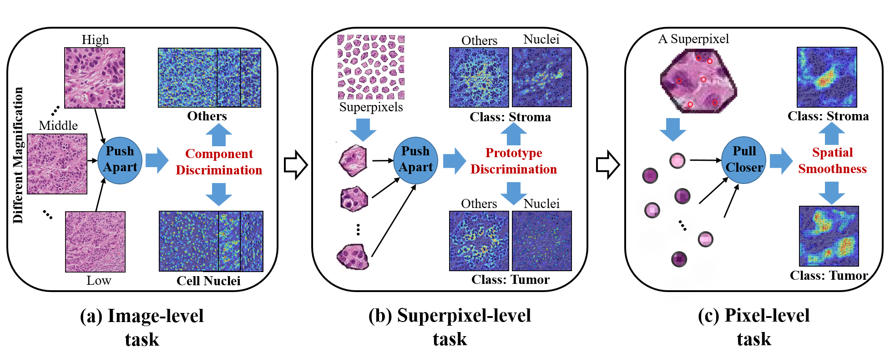

# URL_His_TissueSeg
The source code of paper: **Unsupervised Representation Learning for Tissue Segmentation in Histopathological Images: From Global to Local Contrast**



Our framework is enlightened by a domain-specific cue: different tissues are composed by different cells and extracellular matrices.
Thus, we design three contrastive learning tasks with multi-granularity views (from global to local) for encoding necessary features into representations without accessing annotations.

- (1) an image-level task to capture the difference between tissue components, i.e., encoding the component discrimination; 
- (2) a superpixel-level task to learn discriminative representations of local regions with different tissue components, i.e., encoding the prototype discrimination;
- (3) a pixel-level task to encourage similar representations of different tissue components within a local region, i.e., encoding the spatial smoothness.

## Set Up Environment
```bash
conda env create -f environment.yaml
```

## Dataset
- Download the BCTS dataset from [this link](https://github.com/PathologyDataScience/BCSS).
- Download the GCTS dataset from [this link](https://dataset.chenli.group/home/gastric-cancer-segmentation).
- The pre-training datasets, BCPT and GCPT are too large to upload, Please download from the [GDC portal](https://portal.gdc.cancer.gov/) directly. 

## Usage
For detailed configuration instructions, see `config.py` and `ft_config.py`.

### Pre-training
Setup `config.py`;
```bash
python -m torch.distributed.launch --nproc_per_node=4 --master_port 120520 main-distribute.py --gpus=0,1,2,4
```
### Fine-tuning
Setup `ft_config.py`;
```bash
python finetune.py --gpus=0,1 --seeds=10
```
## Citation

If any part of this code is used, please give appropriate citation to our paper.

## Authors
- Zeyu Gao (betpotti@gmail.com)
- Chen Li (cli@xjtu.edu.cn)

## Institute
[BioMedical Semantic Understanding Group](http://www.chenli.group/home), Xi'an Jiaotong University

## License
This project is licensed under the MIT License - see the [LICENSE](./LICENSE) file for details

## Acknowledgements
The datasets used are in whole or part based upon data generated by [the TCGA Research Network](https://www.cancer.gov/tcga).
